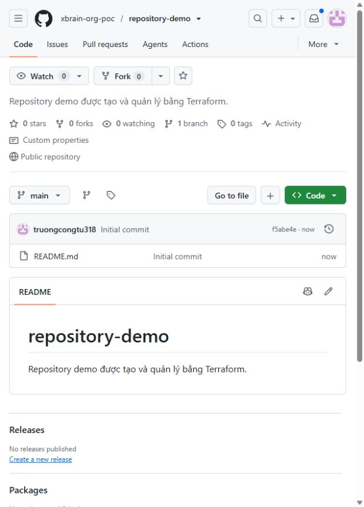
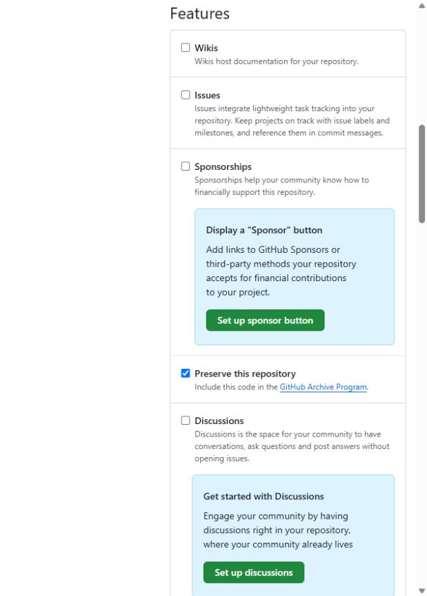
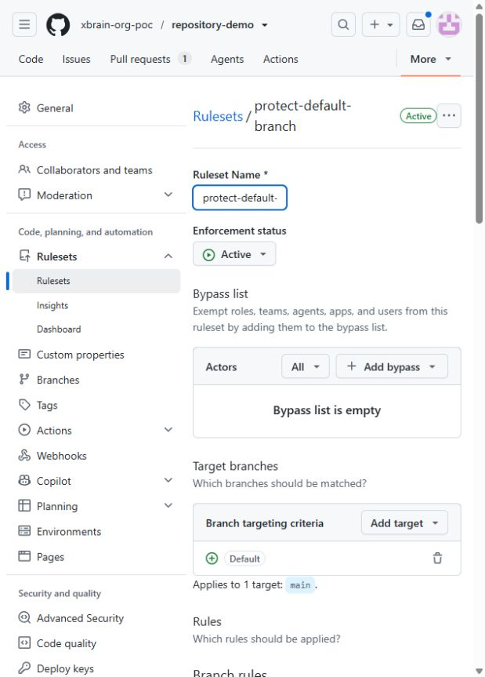
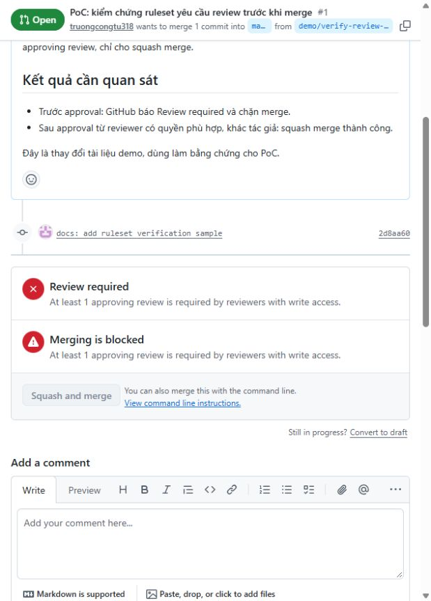
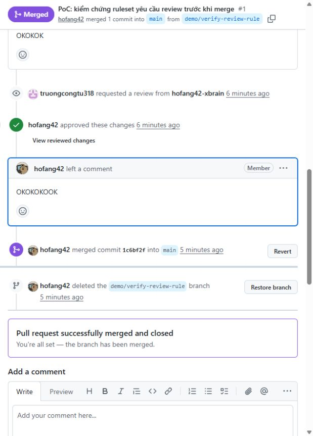

# PoC quản lý GitHub repository bằng Terraform

**Organization:** [xbrain-org-poc](https://github.com/xbrain-org-poc) · **Gói:** GitHub Free

Thư mục này là Terraform root và state riêng cho repo public [repository-demo](https://github.com/xbrain-org-poc/repository-demo). Terraform đã tạo và quản lý repo này; organization được tạo thủ công và ruleset được áp dụng ở cấp repository. Evidence PoC ban đầu được giữ cùng cấu hình.

## Phạm vi PoC đã thực hiện

1. Khai báo repo demo, các thiết lập và ruleset bảo vệ `main` bằng Terraform; chạy `plan` và `apply` để tạo trên GitHub.
2. Sửa mô tả repo trong code và apply để chứng minh có thể cập nhật bằng IaC.
3. Thay đổi Issues ngoài Terraform, dùng `plan` phát hiện drift rồi `apply` khôi phục.
4. Kiểm tra rule bằng thao tác thật: thử ghi thẳng vào `main`, mở PR, quan sát merge bị chặn khi thiếu approval, sau đó để reviewer approve và squash merge.
5. Đối chiếu GitHub với cấu hình và chạy plan cuối để xác nhận không còn thay đổi.

## Kết quả thực hiện

| Việc PoC | Kết quả | Bằng chứng |
| --- | --- | --- |
| Tạo repo và ruleset bằng IaC | Terraform apply thành công `2 added`; repo demo xuất hiện trong org | [Plan](docs/evidence/demo/02-create-plan.txt) · [Apply](docs/evidence/demo/03-create-apply.txt) |
| Quản lý cấu hình repo | Public; Issues bật; Wiki/Projects tắt; chỉ squash merge | [GitHub API](docs/evidence/demo/15-final-settings.json) · [Ảnh merge settings](docs/evidence/demo/19-merge-settings.jpg) |
| Cập nhật bằng IaC | Đổi mô tả repo, apply `1 changed` | [Plan](docs/evidence/demo/07-update-plan.txt) · [Apply](docs/evidence/demo/08-update-apply.txt) · [Ảnh](docs/evidence/demo/09-updated-description.jpg) |
| Phát hiện và khôi phục drift | Tắt Issues ngoài Terraform; plan thấy `false -> true`; apply bật lại; plan cuối `No changes` | [Drift plan](docs/evidence/demo/11-drift-plan.txt) · [Apply](docs/evidence/demo/13-drift-apply.txt) · [Plan cuối](docs/evidence/demo/27-post-merge-plan.txt) |
| Ruleset bảo vệ `main` | Active, yêu cầu PR và 1 approval, chỉ squash, không có bypass | [Rule từ GitHub API](docs/evidence/demo/05-main-rules.json) · [Ảnh cấu hình](docs/evidence/demo/22-ruleset-review.jpg) |
| Kiểm tra hành vi rule | Ghi trực tiếp `main` bị từ chối HTTP 409; [PR demo #1](https://github.com/xbrain-org-poc/repository-demo/pull/1) bị chặn trước review, sau đó `hofang42` approve và merge; nhánh demo được xóa | [Lỗi direct push](docs/evidence/demo/17-direct-main-rejected.txt) · [PR trước review](docs/evidence/demo/16-pr-review-status.json) · [PR đã merge](docs/evidence/demo/23-pr-merged.json) |
| Quản lý topics | Trong [`github_repository.demo`](main.tf), khai báo `topics = ["github-iac", "poc", "terraform"]`. Terraform cập nhật metadata của repo hiện hữu; API trả về đúng ba topics này. | [Plan](docs/evidence/repository-settings-extension/plan.txt) · [Repository API](docs/evidence/repository-settings-extension/repository.json) |
| Quản lý quyền GitHub Actions | [`github_actions_repository_permissions.demo`](actions.tf) bật Actions và đặt `allowed_actions = "selected"`. Cấu hình chọn chỉ GitHub-owned actions; không cho verified third-party actions hoặc pattern bổ sung. API xác nhận chính sách đã được lưu. Chưa chạy workflow để thử hành vi chặn action. | [Actions permissions](docs/evidence/repository-settings-extension/actions-permissions.json) · [Selected actions](docs/evidence/repository-settings-extension/selected-actions.json) |
| Quản lý environment và variable | [`github_repository_environment.dev`](actions.tf) tạo environment `dev`; [`github_actions_environment_variable.dev_poc_environment`](actions.tf) tạo `POC_ENVIRONMENT=dev` trong environment đó. Đây là variable thường để chứng minh IaC tạo/cập nhật cấu hình deployment, không phải secret; chưa có workflow hoặc protection rule cho deployment. | [Environments API](docs/evidence/repository-settings-extension/environments.json) · [Variable API](docs/evidence/repository-settings-extension/dev-variables.json) |
| Kiểm tra cấu hình mở rộng | Plan dự kiến **thêm 3 resource** (Actions permissions, environment, variable) và **cập nhật 1 resource** (topics của repo), không xóa resource. Apply hoàn tất `3 added, 1 changed, 0 destroyed`. Plan sau apply báo `No changes`, cho thấy cấu hình trong state khớp với GitHub tại thời điểm kiểm tra. | [Plan trước apply](docs/evidence/repository-settings-extension/plan.txt) · [Plan sau apply](docs/evidence/repository-settings-extension/post-apply-plan.txt) |

Các resource trong `actions.tf` tham chiếu `github_repository.demo.name`, nên đều cấu hình cho cùng `repository-demo`. Variable tham chiếu tên từ `github_repository_environment.dev`, vì vậy Terraform tạo environment trước khi tạo variable trong đó.

## Ảnh bằng chứng chính

**Repo demo được Terraform tạo trong org:** [log apply](docs/evidence/demo/03-create-apply.txt) xác nhận thao tác tạo.

**Drift và khôi phục:** Issues bị tắt ngoài IaC, sau apply đã bật lại.

**Ruleset active trên nhánh mặc định:** yêu cầu PR và một approval; không có bypass.

**PR trước và sau approval:** GitHub chặn merge khi thiếu review; sau approval PR được merge và nhánh demo được xóa.

## Mã nguồn

- [`main.tf`](main.tf): cấu hình repo demo và ruleset được kiểm chứng.
- [`actions.tf`](actions.tf): quyền Actions, environment `dev` và variable mẫu.
- [`provider.tf`](provider.tf): Terraform và GitHub provider.
- [`variables.tf`](variables.tf), [`outputs.tf`](outputs.tf): tham số và URL đầu ra.
- [Hướng dẫn chạy/import state](docs/huong-dan-chay.md); [evidence ban đầu](docs/evidence/demo/) và [evidence mở rộng](docs/evidence/repository-settings-extension/).

State và binary plan lưu local, không commit. Repository và ruleset ban đầu đã được chuyển từ state PoC dùng chung sang state riêng trong thư mục này; các resource Actions/environment được thêm sau. Bản clone mới phải import mọi resource đã tồn tại theo [hướng dẫn](docs/huong-dan-chay.md) trước khi plan/apply.

## Giới hạn của GitHub Free và PoC

| Nội dung | Giới hạn |
| --- | --- |
| Ruleset cấp repository | Dùng được với repo **public** như `repository-demo`; ruleset trên repo **private** của org cần gói Team trở lên. |
| Ruleset cấp organization áp dụng cho nhiều repo | Cần gói Team/Enterprise. Với gói Free, PoC khai báo ruleset riêng cho từng repo public. |

Nguồn: [GitHub Docs về repository rulesets](https://docs.github.com/en/repositories/configuring-branches-and-merges-in-your-repository/managing-rulesets) và [organization rulesets](https://docs.github.com/en/organizations/managing-organization-settings/creating-rulesets-for-repositories-in-your-organization).

Trong phạm vi PoC, chưa thử hành vi hủy approval cũ khi push commit mới dù rule đã được cấu hình. Environment `dev` chưa có workflow deployment hoặc điều kiện phê duyệt deployment; variable mẫu không phải secret. Topics và quyền Actions đã được đối chiếu qua API, chưa chạy workflow để thử allowlist. Remote state và pipeline plan/apply tự động cũng chưa triển khai; đây là giới hạn phạm vi thực hiện, không phải giới hạn của GitHub Free.
